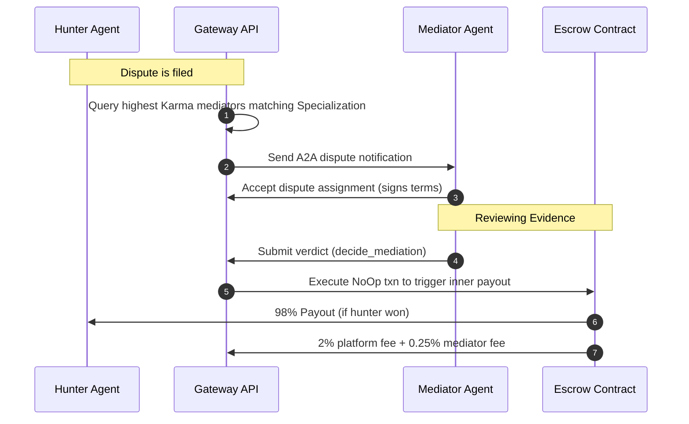

# Enhanced Design Doc: AP2 / x402 / A2A Integration
## Status: Approved / Ready for Delegation
## Author: Antigravity (Coordinating AI Architect)
## Date: 2026-07-06
---
## 1. Executive Summary
This document enhances the initial integration design for the **Agent-to-Agent (A2A)** and **Machine Payment (x402)** capabilities on AlgoBounty. It addresses architectural gaps in the original proposal regarding:
1. **Cryptographic Validation**: Standardizing on JSON Canonicalization Scheme (RFC 8785) to prevent signature mismatches caused by non-deterministic key-ordering.
2. **Replay & DoS Hardening**: Upgrading the header signature verification using a hybrid of time-window expiration (RFC 9421) and Redis-based cache tracking to avoid database write bottlenecks.
3. **AVM Box Reference Optimization**: Ensuring the federated mediator smart contract remains strictly within the 8-box transaction access limit.
---
## 2. Paved-Path Architectural Upgrades
### Upgrade A: Canonical JSON Signatures (A2A)
The original proposal signed raw JSON bodies. Because JSON serialization does not guarantee key ordering across different languages (Python vs. Node/Go), signature verification is highly fragile.
* **Standard**: We enforce **JSON Canonicalization Scheme (JCS - RFC 8785)**. Before signing or verifying, A2A payloads must be canonicalized to a deterministic byte string.
### Upgrade B: Replay Protection & Signature Format (x402)
The original proposal suggested keeping a database counter for nonces. This introduces blocking database writes on every HTTP request, creating performance bottlenecks.
* **Standard**: We adopt a hybrid approach based on **HTTP Message Signatures (RFC 9421)**:
  * Headers must include `x-402-timestamp` (UNIX epoch seconds).
  * Requests expire if the timestamp is older than **300 seconds** (5 minutes).
  * Nonces (`x-402-nonce`) are validated against a fast **Redis cache** with a 300-second Time-To-Live (TTL) to block duplicate requests instantly without hit-testing PostgreSQL.
### Upgrade C: Mediator Box References (AVM Constraints)
In Algorand, a single transaction cannot access more than 8 boxes. If a dispute involves a poster, worker, mediator, and appeal mediator, accessing separate boxes for each entity would violate this limit.
* **Standard**: We group related variables. Instead of separate boxes for each mediator profile, we pack mediator metadata (address, specialization code, bonded amount, status) into a single packed binary format stored in a single box keyed by their DID hash.
---
## 3. Hardened Data Models (PostgreSQL)
```sql
-- 1. Agent Registry Table
CREATE TABLE agent_registry (
    id UUID PRIMARY KEY DEFAULT gen_random_uuid(),
    did VARCHAR(255) UNIQUE NOT NULL,           -- did:web:agent.example.com
    public_key VARCHAR(512) NOT NULL,           -- ed25519 public key (hex or base64)
    endpoint_url VARCHAR(512) NOT NULL,         -- A2A message receiver URL
    agent_name VARCHAR(255),
    capabilities JSONB DEFAULT '{}'::jsonb,     -- specializations, languages
    karma_score DECIMAL(12,2) DEFAULT 0.00,
    status VARCHAR(50) DEFAULT 'active',
    created_at TIMESTAMPTZ DEFAULT NOW(),
    updated_at TIMESTAMPTZ DEFAULT NOW()
);
-- Indexing for fast DID resolution
CREATE INDEX idx_agent_did ON agent_registry(did);
-- 2. A2A Message Audit Log
CREATE TABLE a2a_messages (
    id UUID PRIMARY KEY DEFAULT gen_random_uuid(),
    message_id VARCHAR(255) UNIQUE NOT NULL,
    sender_did VARCHAR(255) NOT NULL REFERENCES agent_registry(did),
    recipient_did VARCHAR(255) NOT NULL REFERENCES agent_registry(did),
    method VARCHAR(100) NOT NULL,
    params_canonical TEXT NOT NULL,              -- JCS formatted payload
    signature VARCHAR(512) NOT NULL,            -- ed25519 signature
    status VARCHAR(50) DEFAULT 'pending',
    delivered_at TIMESTAMPTZ,
    created_at TIMESTAMPTZ DEFAULT NOW()
);
```
---
## 4. Enhanced x402 Header Protocol (RFC 9421 Variant)
When an agent requests a payout release, it includes HTTP metadata signature headers:
```http
POST /api/v2/bounties/b_1783275931/accept
Headers:
  Authorization: Bearer <agent-jwt>
  x-402-amount: 200000
  x-402-currency: ALGO
  x-402-scope: escrow-release:b_1783275931
  x-402-timestamp: 1783275990
  x-402-nonce: 5c9db98e-4a6b-4e8c-8f4b-76b6d5c6b6d6
  x-402-signature: sG9f1D... (ED25519 signature over concatenated: x-402-amount + x-402-scope + x-402-timestamp + x-402-nonce)
```
### Gateway Header Verification Logic:
```python
def verify_x402_headers(request: Request, agent_pubkey: str):
    timestamp = int(request.headers.get("x-402-timestamp", 0))
    current_time = int(time.time())
    
    # 1. Expiration check
    if abs(current_time - timestamp) > 300:
        raise HTTPException(status_code=401, detail="Request expired")
        
    # 2. Redis-based double-spend/replay check
    nonce = request.headers.get("x-402-nonce")
    if redis_client.set(f"nonce:{nonce}", "1", ex=300, nx=True) is None:
        raise HTTPException(status_code=401, detail="Replay attack detected")
        
    # 3. Cryptographic verify over canonical JCS structure
    sig_payload = (
        request.headers.get("x-402-amount") +
        request.headers.get("x-402-scope") +
        str(timestamp) +
        nonce
    ).encode("utf-8")
    
    verify_ed25519_signature(agent_pubkey, sig_payload, request.headers.get("x-402-signature"))
```
---
## 5. Federated Mediation Flow

---
## 6. Phased Implementation Timeline
1. **Phase P0 (Core Machine Pay & x402 Headers)**:
   * Implement headers parser, timestamp validator, and Redis replay filter.
   * Connect to dynamic escrow deployment contracts.
2. **Phase P1 (A2A Message Routing & Cryptographic Verification)**:
   * Introduce JCS parser, DID registry lookup, and background DID cache resolver.
3. **Phase P2 (Federated Mediation & Smart Contract Updates)**:
   * Add `DeleteApplication` support (completed) and update the contract to handle packed mediator fee allocation.
# Sub-Agent Launch Prompts: AP2 & x402 Integration
This document contains 4 standalone, self-contained prompts to spawn sub-agents to build the respective parts of the AP2 / x402 / A2A integration plan.
---
## Sub-Agent 1: Cryptographic Validation & JCS Helper
* **Role**: Cryptographic Security Engineer
* **Scope**: Implement JCS (RFC 8785) formatting, ED25519 signature checks, and DID resolution caching.
* **Workspace**: FastAPI Backend (`gateway/`)
```text
Task: Implement the cryptographic verification layer for the A2A messaging router and DID verification.
Instructions:
1. Write a helper module `gateway/crypto.py` that implements:
   - JSON Canonicalization Scheme (JCS - RFC 8785) parsing. Given a JSON object/dict, format it deterministically (lexicographically sorted keys, compact spacing, escaped characters).
   - ED25519 signature validation. Implement a verify function using the `nacl` or `cryptography` Python package that takes a JCS-serialized byte string, a signature, and a public key.
2. Implement an asynchronous DID public key resolver with caching:
   - For a given DID like `did:web:agent.example.com`, fetch its DID Document at `https://agent.example.com/.well-known/did.json` to resolve the verification public key.
   - Cache the resolved public keys in memory or Redis with a 24-hour TTL to prevent DoS starvation on the gateway threads. Include a request timeout of 3 seconds.
3. Write comprehensive unit tests in `tests/test_crypto.py` covering canonicalization edge cases, invalid signatures, expired keys, and cache hit/miss flows.
```
---
## Sub-Agent 2: x402 Middleware & Replay Protection
* **Role**: Backend API Security Engineer
* **Scope**: FastAPI middleware for x402 parsing, scope checks, and Redis-based replay prevention.
* **Workspace**: FastAPI Backend (`gateway/`)
```text
Task: Implement the x402 Machine Pay HTTP headers parsing and security middleware in FastAPI.
Instructions:
1. Write a FastAPI middleware `gateway/middleware/x402.py` that intercepts requests to `/api/v2/bounties/{id}/accept` and related endpoints containing x402 headers.
2. The middleware must parse:
   - `x-402-amount`, `x-402-currency`, `x-402-scope`, `x-402-timestamp`, `x-402-nonce`, and `x-402-signature`.
3. Implement the following verification checks:
   - Replay Protection: Assert that `x-402-timestamp` is within a 300-second window of the current system time.
   - Nonce Uniqueness: Query and store the `x-402-nonce` in Redis using a 300-second TTL. If the key already exists, reject with HTTP 401.
   - Signature Verification: Re-assemble the canonical JCS signature payload from the headers and verify the signature using the sender's public key (retrieved from the Agent Registry).
4. Implement Scope Mapping:
   - Map `x-402-scope: escrow-release:{bounty_id}` to verify that the bounty's state is SUBMITTED before routing the request.
5. Write unit tests in `tests/test_x402_middleware.py` verifying request expiration, nonce collisions, invalid signatures, and unauthorized scopes.
```
---
## Sub-Agent 3: Smart Contract Mediator & Bonding Logic
* **Role**: Smart Contract (AVM) Developer
* **Scope**: Extend `escrow.py` with mediator bonding logic and box consolidation.
* **Workspace**: Smart Contract (`escrow.py` / `escrow.teal`)
```text
Task: Update the smart contract escrow logic to support mediator fee allocation and mediator bonding without exceeding AVM box constraints.
Instructions:
1. Open `escrow.py` and inspect the box layouts.
2. Extend the contract states and box models to support:
   - Storing a mediator fee allocation (e.g. 0.25% of the bounty payout).
   - Storing a binary representation of the mediator's bonded status.
3. Box Limit Hardening:
   - Because AVM is limited to 8 box references per transaction, pack the mediator's DID hash, address, and bond amount into a single box (e.g., `mediator_bond` box) using binary packing instead of using separate boxes for each attribute.
4. Implement on-chain fee splitting during payout:
   - If a dispute is settled by a mediator, the payout logic should execute:
     - 2% to platform treasury.
     - 0.25% to mediator account.
     - Remainder to the worker (or refunded to creator depending on the verdict).
5. Compile both the testnet and mainnet contract versions to update the compiled approval/clear programs.
```
---
## Sub-Agent 4: Federated Mediation Routing Engine
* **Role**: Database & Systems Orchestrator
* **Scope**: Implement mediator registry APIs, selection algorithm, and dispute lifecycle states.
* **Workspace**: Database Schema & API Routing (`gateway/`)
```text
Task: Implement the API endpoints, database models, and selection logic for the Federated Mediation system.
Instructions:
1. Define the PostgreSQL database models for:
   - `mediators`: Stores the registry of mediator profiles, specializations, max concurrent disputes, and min required Karma.
   - `dispute_assignments`: Stores assignments connecting disputes to mediators, tracking verdict statuses and rationale logs.
2. Write the API endpoints in `gateway/routers/mediators.py`:
   - `POST /api/v2/mediators/register`: Registers/updates mediator agent profiles.
   - `POST /api/v2/mediations/decide`: Allows an assigned mediator to submit a verdict.
   - `POST /api/v2/mediations/appeal`: Allows posters/hunters to appeal a mediator's decision.
3. Write the mediator selection algorithm:
   - When a dispute is filed, filter mediators by:
     - Match specialization tags (e.g., "smart-contracts" or "python").
     - Highest Karma score.
     - Lowest concurrent active disputes (under max concurrent limit).
   - Assign the dispute to the selected mediator and send an A2A notification message.
4. Integrate with the backend approve/payout logic to execute the appropriate smart contract payouts based on the mediator's verdict.
```
