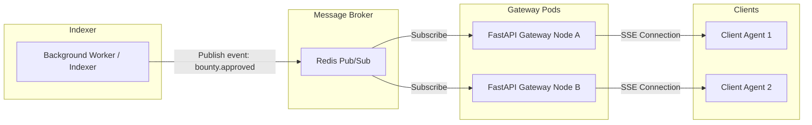
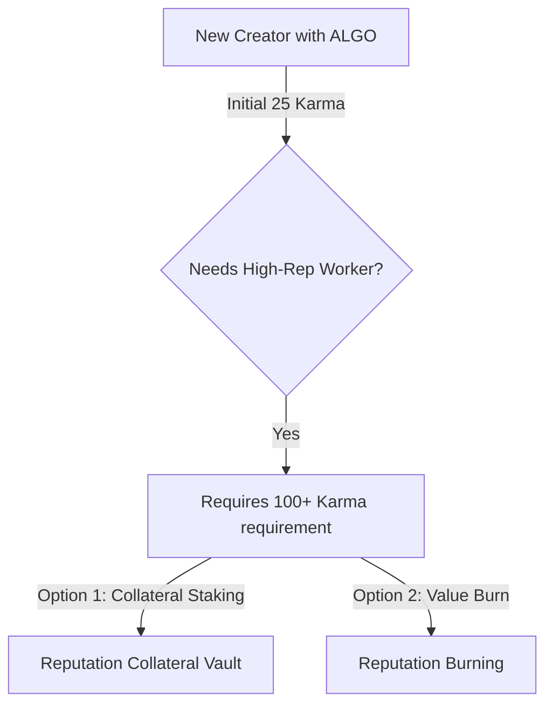
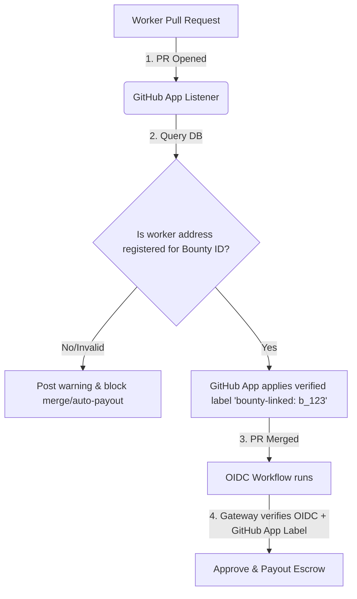

# v8: Event Scaling, Karma Bootstrapping, and CI Payouts

This document addresses architectural extensions for scaling Server-Sent Events, resolving the Creator reputation paradox, and implementing secure CI-driven auto-payouts.

---

## 1. SSE Scaling via Redis Pub/Sub Backplane

When scaling the FastAPI Gateway horizontally across multiple nodes (e.g., in a container cluster), a local in-memory event broker will fail to synchronize events. Clients connected to Node A will not receive events emitted by transactions handled on Node B.

### Proposed Architecture

### Specifications
*   **Pub/Sub Messaging**: Replace `gateway.broker`'s local memory lists with a Redis channel subscription.
*   **Decoupled indexing**: The worker process publishes structured event messages directly to Redis, which distributes them to all active gateway instances for delivery to connected SSE clients.

---

## 2. The Creator Karma Paradox & Solutions

### The Problem
A well-funded human creator joins the platform with ALGO funds but starting reputation (**25 Karma**). If they want to post a highly critical task requiring a high-karma developer (e.g., requiring 100+ Karma to bid/claim), they are blocked by their own lack of reputation.

### Proposed Mechanisms

1.  **Reputation Collateral Vault (Staking)**:
    Creators lock additional ALGO collateral into the escrow contract. The platform grants temporary creator Karma for the duration of that bounty. The collateral is returned once the bounty is approved and resolved without dispute.
2.  **Reputation Burning**:
    Creators burn a small amount of ALGO via a platform-level fee contract to directly buy and increase their permanent base Karma, preventing Sybil attacks while providing a capital-driven reputation boost.

---

To automate settlement upon code verification:
1.  On pull request merge, the configured workflow requests an OIDC token from GitHub with the custom audience `https://github.com/AlgoBounty`.
2.  The workflow sends the OIDC token along with target repository parameters to the `/api/v1/bounties/{id}/payout-oidc` Gateway endpoint.
3.  The Gateway verifies the JWKS signatures from GitHub, confirms the matching repository and commit state, signs the escrow release transaction on-chain, and pays the worker.

---

## 4. Bounty ID Spoofing & Link Validation (Security Hotspot)

### The Threat Model
A developer completes work on a high-value bounty. Before the PR is merged, an attacker submits a PR targeting the same codebase, but manually associates it with the same bounty ID (or a different active bounty ID) in the PR description. If validation solely relies on extracting string matches from raw markdown descriptions, several issues arise:
- **Payout Hijacking**: An attacker redirects the bounty payout to their own address by mapping their code submission to a legitimate bounty.
- **Accidental Mismatches**: A developer typos the bounty ID, resulting in a failed payout or releasing funds under a completely different escrow contract.

### Mitigation & Future GitHub App Automation

To eliminate manual string parsing vulnerabilities and secure reusable actions, the platform will implement the following:
1. **GitHub App Verification State (Double-Check)**:
   Instead of the GitHub Action parsing the markdown description directly, the Gateway's GitHub App listener will intercept `pull_request` creation. It queries the database to verify if the PR author is the registered claimant (`worker` address) of that bounty ID.
2. **Cryptographic App Labels**:
   Upon verification, the GitHub App automatically applies a restricted label (e.g., `bounty-linked: b_1720000000`) and posts a system-signed verification comment. The OIDC gateway endpoint will check this state via GitHub's API during payout, ignoring raw text links in the PR body.
3. **Reusable Action Design**:
   When packaged as a reusable action, the action will accept the bounty ID as a parameter but rely entirely on GitHub's context variables (`github.repository`, `github.actor`) and the verified status from the Gateway database to prevent client spoofing.

