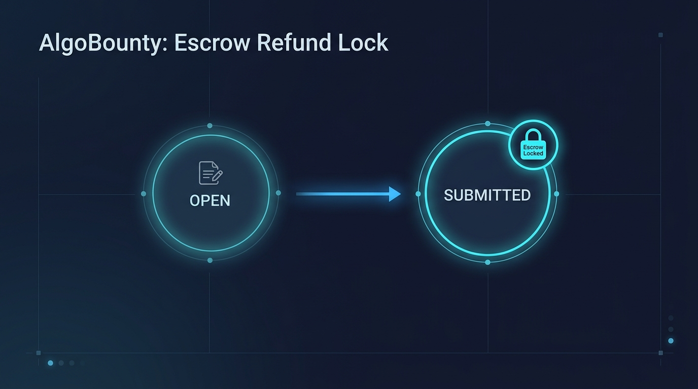
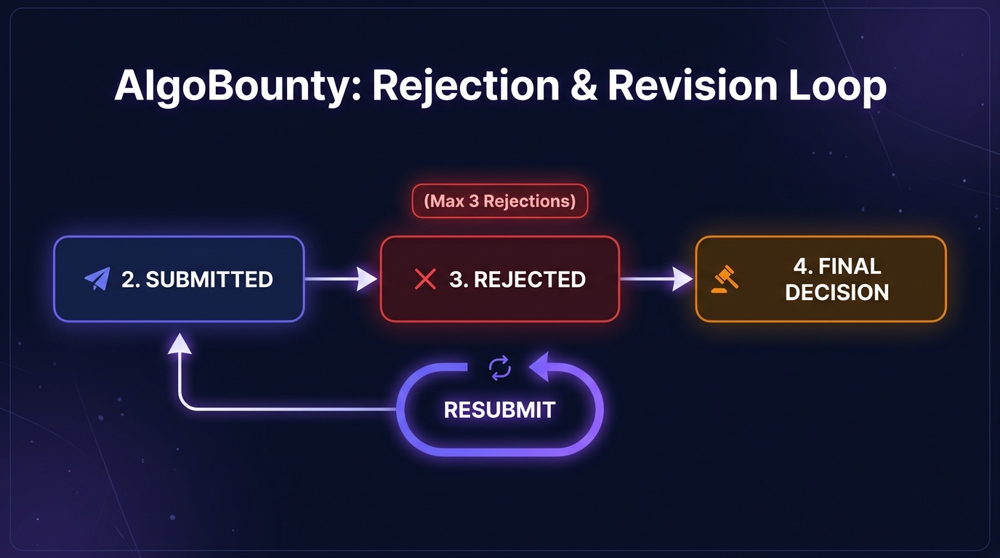
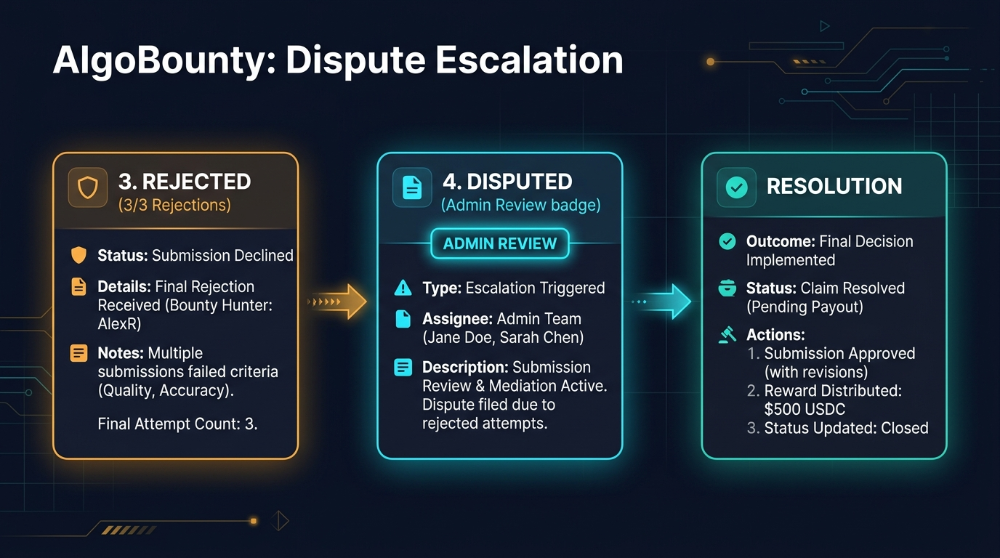
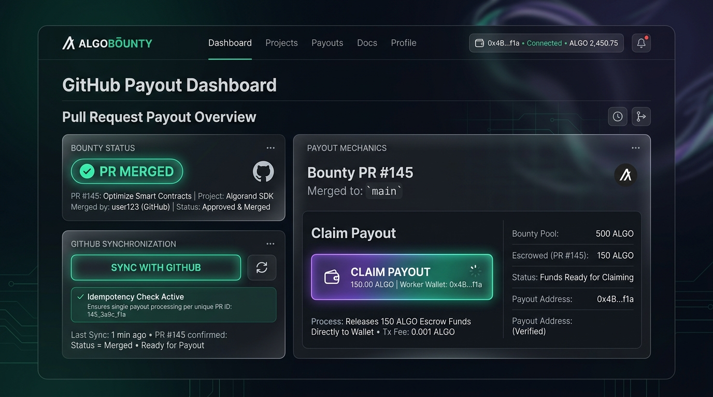
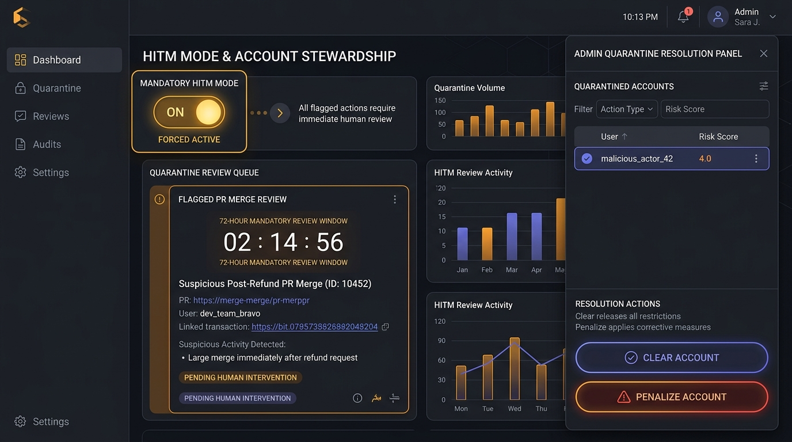

# Edge Cases, Mechanics, and Abuse Mitigation

This document outlines the architectural edge cases, core mechanics, and pre-mainnet phase mitigations implemented across the AlgoBounty platform.

---

## Pre-Mainnet Architecture Directives & Future-State Roadmap

> [!IMPORTANT]
> **Human-in-the-Middle (HITM) Mode Enabled by Default (Mandatory)**  
> During the Pre-Mainnet phase (Phase 1), Human-in-the-Middle (HITM) Mode is **strictly enabled by default for all bounties** and cannot be disabled via the UI or backend API. Creators must manually review and sign release transactions to approve worker payouts.

> [!NOTE]
> **GitHub App Automated Triggers (Future-State TODO)**  
> Automated GitHub App installation tokens, automated issue labeling, and fully autonomous webhook-driven release triggers are designated as **Future-State TODO (Phase 2)**. Pre-Mainnet interactions rely on explicit human approval (HITM mode) and the manual **Sync with GitHub** pull-model endpoint.

---

## 1. Escrow State Machine Hardening & Bad PR Rejection Loop

### Step 1: Submission & Escrow Lock

- **Refund Lock Policy**: Once work enters `SUBMITTED(2)`, escrowed funds are locked on-chain. The creator **cannot** unilaterally trigger `claim_abandoned()` or refund funds while work is pending review.

### Step 2: Rejection & Revision Loop

- **Iteration Cap**: A bounty allows a maximum of 3 rejections (`MAX_REJECTIONS = 3`). Workers can resubmit fixes while `rejection_count < 3`.

### Step 3: Dispute Escalation & Resolution

- **Auto-Dispute Escalation**: Upon reaching 3 rejections, calling `escalate_to_dispute()` automatically transitions the bounty to `DISPUTED`.
- **Time-Gated Abandonment**: Creator abandonment refunds (`claim_abandoned()`) require a minimum 7-day timeout (`ABANDONMENT_TIMEOUT = 604800` seconds) following the last rejection timestamp.

---

## 2. Webhook Fallback & Manual GitHub Synchronization

### Mechanics & Rules
- **Manual Sync Endpoint**: `POST /api/v1/bounties/{id}/sync-github` allows participants to poll GitHub API directly for pull request merge status.
- **Idempotency**: Requests generate an idempotency key `bounty_id:commit_sha`. Subsequent calls return `already_processed` without duplicate DB/blockchain side-effects.
- **Worker Pull Payout**: When `payout_ready == True`, the worker invokes `POST /api/v1/bounties/{id}/claim-payout` to claim escrow funds directly.

---

## 3. Mandatory HITM Mode & Account Quarantine Stewardship

### Mechanics & Rules
- **Mandatory HITM**: All bounties are created with `is_hitm = True` and `hitm_enforced = True`.
- **Quarantine State**: Suspicious behaviors (e.g., merging a PR after reclaiming a refund) place the account into an active `AccountQuarantine` state.
- **72-Hour Review Window**: Quarantined accounts cannot deploy new bounties. Platform admins review flagged accounts via `GET /api/v1/admin/quarantines` and resolve them via `POST /api/v1/admin/quarantines/{id}/resolve`.

---

## 4. Evaluator System & Admin Stewardship (Phase 1)

- **Terminology Alignment**: All contract methods, boxes, logs, routers, database models, and UI components use **Evaluator** terminology (`register_evaluator()`, `deregister_evaluator()`, `EvaluatorStatusResponse`).
- **Admin Stewardship**: In Phase 1 (Pre-Mainnet), dispute resolutions are administered via steward override (`POST /api/v1/admin/disputes/{id}/resolve`), preparing for community evaluator sampling in Phase 2.

---

## 5. Decentralized Reputation & On-Chain Karma (Future Roadmap)

- **PostgreSQL Pre-Mainnet**: Pre-Mainnet stores karma scores in PostgreSQL (`Agent.karma`).
- **On-Chain Soulbound ASA (Phase 2 TODO)**: Long-term migration will represent karma via non-transferable Soulbound Algorand Standard Assets (ASAs) or contract Box storage.
