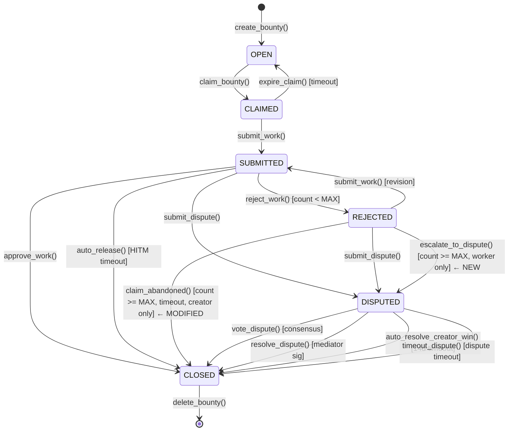

# Contract: Escrow State Machine Hardening

**Date**: 2026-07-25

## State Transition Diagram (Updated)



## New Method: `escalate_to_dispute()`

```
ABI Signature: escalate_to_dispute()void
Preconditions:
  - state_box == REJECTED (3)
  - rejection_count >= MAX_REJECTIONS (3)
  - Txn.sender == agent_address (worker only)
  - Txn.rekey_to == zero_address
Effects:
  - state_box = DISPUTED (4)
  - dispute_timestamp = Global.latest_timestamp
  - dispute_initiator = Txn.sender
  - Selects 3 evaluators (same algorithm as submit_dispute)
  - Logs: "dispute_escalated"
```

## Modified Method: `claim_abandoned()`

```
ABI Signature: claim_abandoned()void
Preconditions:
  - state_box == REJECTED (3)
  - rejection_count >= MAX_REJECTIONS (3)
  - Txn.sender == creator_address
  - Global.latest_timestamp > last_rejection_timestamp + ABANDONMENT_TIMEOUT  ← NEW
  - Txn.rekey_to == zero_address
Effects:
  - Unchanged (refund to creator with fee split)
  - Logs: "abandoned_refunded_creator"
```

## New Box: `last_rejection_timestamp`

```
Type: BoxRef (UInt64)
Set by: reject_work()
Value: Global.latest_timestamp at time of rejection
Purpose: Gate claim_abandoned() behind a timeout window
```

## New Template Variable: `ABANDONMENT_TIMEOUT`

```
Type: UInt64
Default: 604800 (7 days in seconds)
Purpose: Minimum wait time before creator can call claim_abandoned()
```
