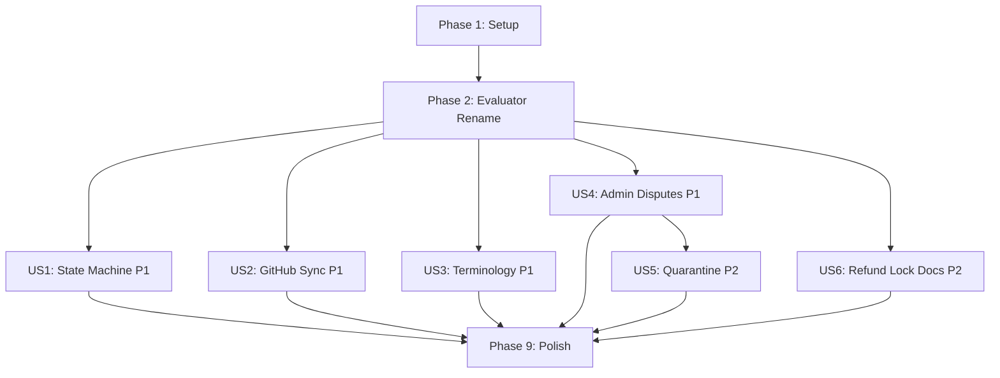

# Tasks: Phase 1 Pre-Mainnet Hardening

**Input**: Design documents from `specs/002-phase1-hardening/`

**Prerequisites**: plan.md ✅, spec.md ✅, research.md ✅, data-model.md ✅, contracts/ ✅, quickstart.md ✅

**Tests**: Included — the spec explicitly defines independent test criteria per story and the quickstart.md defines 7 validation scenarios.

**Organization**: Tasks grouped by user story. US1-US4 are P1 (can run in parallel after foundational). US5-US6 are P2.

## Format: `[ID] [P?] [Story] Description`

- **[P]**: Can run in parallel (different files, no dependencies)
- **[Story]**: Which user story this task belongs to (e.g., US1, US2, US3)
- Include exact file paths in descriptions

## Path Conventions

- **Backend**: `gateway/` at repository root
- **Frontend**: `dashboard/src/` at repository root
- **Smart Contract**: `escrow.py` at repository root
- **Tests**: `tests/` at repository root

---

## Phase 1: Setup (Shared Infrastructure)

**Purpose**: Branch creation, dependency audit, and shared model prerequisites

- [X] T001 Create and checkout git branch `002-phase1-hardening` from main
- [X] T002 Add `AccountQuarantine` SQLAlchemy model to `gateway/supabase_migration.py` with fields: id, address, reason, details, quarantined_at, expires_at, status, resolved_by, resolved_at, resolution_note
- [X] T003 [P] Add `SyncRecord` SQLAlchemy model to `gateway/supabase_migration.py` with fields: id, bounty_id, triggered_by, triggered_at, github_state, action_taken, idempotency_key (unique)
- [X] T004 [P] Add `payout_ready` (Boolean, default=False) and `payout_ready_at` (DateTime, nullable) columns to the existing `Bounty` model in `gateway/supabase_migration.py`
- [X] T005 [P] Add `last_rejection_timestamp` BoxRef (UInt64) declaration to `EscrowContract` class in `escrow.py`
- [X] T006 [P] Add `ABANDONMENT_TIMEOUT` TemplateVar (UInt64, default 604800) to `EscrowContract` class in `escrow.py`

---

## Phase 2: Foundational (Blocking Prerequisites — Evaluator Rename)

**Purpose**: Rename all "arbitrator" references to "evaluator" across the entire stack. This MUST complete before user story work begins because it touches every layer.

**⚠️ CRITICAL**: No user story work can begin until this phase is complete. The rename affects the smart contract ABI, gateway schemas, DB models, routers, worker log parsing, frontend API types, and tests.

### Smart Contract Rename

- [X] T007 Rename `register_arbitrator()` → `register_evaluator()` ABI method in `escrow.py` including its docstring and all internal references
- [X] T008 [P] Rename `deregister_arbitrator()` → `deregister_evaluator()` ABI method in `escrow.py` including its docstring and all internal references
- [X] T009 [P] Rename BoxRef state variables `arbitrator_1`, `arbitrator_2`, `arbitrator_3` → `evaluator_1`, `evaluator_2`, `evaluator_3` in `escrow.py`
- [X] T010 [P] Rename BoxRef state variables `arbitrator_1_vote`, `arbitrator_2_vote`, `arbitrator_3_vote` → `evaluator_1_vote`, `evaluator_2_vote`, `evaluator_3_vote` in `escrow.py`
- [X] T011 Rename all log strings from `arbitrator_registered`, `arbitrator_deregistered`, `arbitrator_voted` → `evaluator_registered`, `evaluator_deregistered`, `evaluator_voted` in `escrow.py`

### Gateway Backend Rename

- [X] T012 Rename file `gateway/routers/arbitrators.py` → `gateway/routers/evaluators.py` and update the router prefix from `/api/v1/arbitrators` to `/api/v1/evaluators`
- [X] T013 Update `gateway/main.py` to import and mount `evaluators.router` instead of `arbitrators.router`
- [X] T014 [P] Rename schema classes in `gateway/schemas.py`: `ArbitratorRegistrationResponse` → `EvaluatorRegistrationResponse`, `ArbitratorResponse` → `EvaluatorResponse`, `ArbitratorListResponse` → `EvaluatorListResponse`, `ArbitratorMeResponse` → `EvaluatorMeResponse`, `ArbitratorVoteResponse` → `EvaluatorVoteResponse`
- [X] T015 [P] Rename DB table `arbitrators` → `evaluators` and `dispute_arbitrators` → `dispute_evaluators` in `gateway/supabase_migration.py`, including the model class names `Arbitrator` → `Evaluator` and `DisputeArbitrator` → `DisputeEvaluator`, and column `arbitrator_address` → `evaluator_address`
- [X] T016 Update all imports and references to renamed models across `gateway/database.py`, `gateway/routers/evaluators.py`, `gateway/routers/bounties.py`, and any other files importing `Arbitrator` or `DisputeArbitrator`
- [X] T017 Update `gateway/worker.py` log parsing: change all references to `arbitrator_voted` → `evaluator_voted`, `arbitrator_registered` → `evaluator_registered`, `arbitrator_deregistered` → `evaluator_deregistered`, and update `Arbitrator`/`DisputeArbitrator` model references to `Evaluator`/`DisputeEvaluator`

### Frontend Rename

- [X] T018 [P] Update `dashboard/src/lib/api.ts`: rename all `Arbitrator` types to `Evaluator`, update endpoint paths from `/arbitrators` to `/evaluators`
- [X] T019 [P] Update `dashboard/src/app/mediators/page.tsx`: rename all `arbitrator` variable names, API calls, and type references to `evaluator`
- [X] T020 [P] Update `dashboard/src/components/DashboardLayout.tsx`: verify nav link for mediators/evaluators uses correct terminology in labels

### Tests Rename

- [X] T021 Rename file `tests/test_arbitrators.py` → `tests/test_evaluators.py` and update all class names, assertion strings, route paths, and model references from `arbitrator` to `evaluator`

### Rename Verification

- [X] T022 Run `grep -riI "arbitrator" gateway/ dashboard/src/ escrow.py tests/ --include="*.py" --include="*.ts" --include="*.tsx"` and verify zero matches (excluding `__pycache__`, `node_modules`, `.next`)

**Checkpoint**: All "arbitrator" references eliminated. Smart contract ABI methods renamed. Foundation ready for user story implementation.

---

## Phase 3: User Story 1 — Escrow State Machine Hardening (Priority: P1) 🎯 MVP

**Goal**: After MAX_REJECTIONS, worker can escalate to dispute. Creator's `claim_abandoned()` is time-gated behind a 7-day window. No deadlock state possible.

**Independent Test**: Create a bounty → submit work → reject 3× → verify worker can escalate to DISPUTED, verify creator cannot call `claim_abandoned()` before timeout.

### Tests for US1

- [X] T023 [P] [US1] Write test `test_escalate_to_dispute_after_max_rejections` in `tests/test_evaluators.py` — simulate 3 rejections then worker calls `escalate_to_dispute()`, assert state == DISPUTED
- [X] T024 [P] [US1] Write test `test_claim_abandoned_blocked_before_timeout` in `tests/test_evaluators.py` — after 3 rejections, creator calls `claim_abandoned()` immediately, assert failure
- [X] T025 [P] [US1] Write test `test_claim_abandoned_allowed_after_timeout` in `tests/test_evaluators.py` — after 3 rejections + 7 day wait, creator calls `claim_abandoned()`, assert state == CLOSED with REFUND
- [X] T026 [P] [US1] Write test `test_refund_blocked_from_submitted_state` in `tests/test_evaluators.py` — verify no contract method allows creator refund from SUBMITTED state

### Implementation for US1

- [X] T027 [US1] Set `self.last_rejection_timestamp.value = Global.latest_timestamp` inside `reject_work()` method in `escrow.py` (both SUBMITTED→REJECTED branch and existing rejection counter update)
- [X] T028 [US1] Add new `escalate_to_dispute()` ABI method in `escrow.py` — preconditions: `state == REJECTED`, `rejection_count >= MAX_REJECTIONS`, `sender == agent_address`. Effects: set state to DISPUTED, record dispute_timestamp, set dispute_initiator, select 3 evaluators (reuse logic from `submit_dispute()`), log `dispute_escalated`
- [X] T029 [US1] Modify `claim_abandoned()` in `escrow.py` to add timeout guard: `assert Global.latest_timestamp > self.last_rejection_timestamp.value + TemplateVar[UInt64]("ABANDONMENT_TIMEOUT")`
- [X] T030 [US1] Extract the evaluator selection logic from `submit_dispute()` into a shared helper method `_select_evaluators()` in `escrow.py` to avoid code duplication with `escalate_to_dispute()`
- [X] T031 [US1] Update `gateway/worker.py` to parse the new `dispute_escalated` log event and update DB status to `disputed` (same handling as `dispute_submitted`)
- [X] T032 [US1] Run tests: `PYTHONPATH=. python -m pytest tests/test_evaluators.py -v -k "escalate or abandoned or refund_blocked"`

**Checkpoint**: State machine hardened. Worker can escalate after max rejections. Creator's refund path is time-gated. No deadlock possible.

---

## Phase 4: User Story 2 — Manual GitHub Synchronization (Priority: P1)

**Goal**: When webhooks fail, any user can trigger a manual sync. Worker authorizes payout via pull model.

**Independent Test**: Create bounty with GitHub link → disable webhooks → manually sync → worker claims payout. Second sync returns idempotent `already_processed`.

### Tests for US2

- [X] T033 [P] [US2] Write test `test_sync_github_detects_merged_pr` in `tests/test_sync_github.py` — mock GitHub API to return merged PR, call sync endpoint, assert `payout_ready == True`
- [X] T034 [P] [US2] Write test `test_sync_github_idempotent` in `tests/test_sync_github.py` — call sync twice for same merge event, assert second returns `already_processed` and no duplicate SyncRecord
- [X] T035 [P] [US2] Write test `test_claim_payout_worker_only` in `tests/test_sync_github.py` — non-worker calls claim-payout, assert 403; worker calls, assert 200 with payout
- [X] T036 [P] [US2] Write test `test_claim_payout_requires_payout_ready` in `tests/test_sync_github.py` — worker calls claim-payout before sync, assert 409

### Implementation for US2

- [X] T037 [US2] Add `SyncGithubResponse` and `ClaimPayoutResponse` Pydantic schemas to `gateway/schemas.py`
- [X] T038 [US2] Implement `POST /api/v1/bounties/{bounty_id}/sync-github` endpoint in `gateway/routers/bounties.py` — fetch GitHub issue/PR state via `gateway/github.py`, check idempotency via SyncRecord, set `bounty.payout_ready = True` if merged, rate limit 10/hr per bounty
- [X] T039 [US2] Implement `POST /api/v1/bounties/{bounty_id}/claim-payout` endpoint in `gateway/routers/bounties.py` — verify JWT sender == bounty.worker, verify payout_ready == True, call `release_trustless()`, update bounty status to closed, apply karma
- [X] T040 [US2] Add GitHub state verification helper function in `gateway/github.py` — `async def check_github_contribution_state(bounty) -> dict` returning `{state: "merged"|"closed"|"open", sha: str, event_id: str}`
- [X] T041 [US2] Add "Sync with GitHub" button to the bounty detail page in `dashboard/src/app/bounties/[id]/page.tsx` — visible when bounty status is `submitted` and webhook hasn't triggered payout
- [X] T042 [US2] Add "Claim Payout" button to the bounty detail page in `dashboard/src/app/bounties/[id]/page.tsx` — visible when `payout_ready == true`, calls `POST /api/v1/bounties/{id}/claim-payout` with JWT, shows success/error toast
- [X] T043 [US2] Add `syncGithub(bountyId)` and `claimPayout(bountyId)` API client methods to `dashboard/src/lib/api.ts`
- [X] T044 [US2] Run tests: `PYTHONPATH=. python -m pytest tests/test_sync_github.py -v`

**Checkpoint**: Manual sync and pull-model payout functional. Webhooks can fail without blocking workers.

---

## Phase 5: User Story 3 — Platform Terminology Alignment (Priority: P1)

**Goal**: Zero instances of "arbitrator"/"arbitration" in user-facing docs and legal text.

**Independent Test**: `grep -riI "arbitrator\|arbitration" docs/ gateway/ dashboard/ escrow.py` returns zero hits.

> **NOTE**: The code-level rename was completed in Phase 2 (Foundational). This phase covers documentation, legal text, and any remaining user-facing strings.

### Implementation for US3

- [X] T045 [P] [US3] Update `docs/edge_cases_and_abuse_mitigation.md` — replace all "arbitrator"/"arbitration" references with "evaluator"/"evaluation"
- [X] T046 [P] [US3] Update `AGENTS.md` — replace all "arbitrator"/"arbitration" references with "evaluator"/"evaluation" in the project guide
- [X] T047 [P] [US3] Update `README.md` — replace all "arbitrator"/"arbitration" references with "evaluator"/"evaluation"
- [X] T048 [P] [US3] Update all design documents in `specs/` — search and replace "arbitrator"/"arbitration" with "evaluator"/"evaluation"
- [X] T049 [P] [US3] Search `v0-v7-*.md` design documents for "arbitrator"/"arbitration" references and update to "evaluator"/"evaluation"
- [X] T050 [US3] Run comprehensive grep verification: `grep -riI "arbitrator\|arbitration" docs/ gateway/ dashboard/src/ escrow.py tests/ specs/ AGENTS.md README.md --include="*.py" --include="*.ts" --include="*.tsx" --include="*.md"` — assert zero matches

**Checkpoint**: Zero instances of "arbitrator"/"arbitration" across the entire project.

---

## Phase 6: User Story 4 — Admin-Gated Dispute Resolution (Priority: P1)

**Goal**: All Phase 1 disputes route to admin. Admin can render resolution (worker_win, creator_win, split) via a dedicated endpoint.

**Independent Test**: Create a dispute → admin calls resolve endpoint → bounty closes with correct payout type.

### Tests for US4

- [X] T051 [P] [US4] Write test `test_admin_resolve_dispute_worker_win` in `tests/test_admin_disputes.py` — admin resolves in favor of worker, assert bounty status == closed, payout_type == PAYOUT
- [X] T052 [P] [US4] Write test `test_admin_resolve_dispute_creator_win` in `tests/test_admin_disputes.py` — admin resolves in favor of creator, assert bounty status == closed, payout_type == REFUND
- [X] T053 [P] [US4] Write test `test_admin_resolve_non_admin_rejected` in `tests/test_admin_disputes.py` — non-admin calls resolve, assert 403

### Implementation for US4

- [X] T054 [US4] Add `ADMIN_ADDRESS` config field to `gateway/config.py` — reads from environment variable, defaults to platform mediator address
- [X] T055 [US4] Add `is_admin()` dependency function to `gateway/auth.py` — verifies JWT wallet address matches `ADMIN_ADDRESS`
- [X] T056 [US4] Create `gateway/routers/admin.py` with router prefix `/api/v1/admin` — implement `POST /api/v1/admin/disputes/{bounty_id}/resolve` accepting `{resolution, reason}`, verify admin auth, call `resolve_dispute()` on contract with platform mediator signature
- [X] T057 [US4] Add `AdminResolveRequest` and `AdminResolveResponse` Pydantic schemas to `gateway/schemas.py`
- [X] T058 [US4] Mount `admin.router` in `gateway/main.py`
- [X] T059 [US4] Run tests: `PYTHONPATH=. python -m pytest tests/test_admin_disputes.py -v`

**Checkpoint**: Admin can resolve disputes. Phase 1 dispute resolution functional without community evaluator panels.

---

## Phase 7: User Story 5 — Quarantine State for Suspicious Activity (Priority: P2)

**Goal**: Suspicious activity triggers a 72hr account quarantine. Admin can review and clear/penalize. Users see quarantine status.

**Independent Test**: Trigger quarantine → verify account blocked from creating bounties → admin clears → account restored.

### Tests for US5

- [X] T060 [P] [US5] Write test `test_quarantine_blocks_bounty_creation` in `tests/test_quarantine.py` — quarantine account, attempt bounty creation, assert 403 with quarantine message
- [X] T061 [P] [US5] Write test `test_quarantine_auto_expires` in `tests/test_quarantine.py` — quarantine account, simulate 73 hours passing, assert quarantine status == expired/inactive
- [X] T062 [P] [US5] Write test `test_admin_clear_quarantine` in `tests/test_quarantine.py` — quarantine account, admin clears, assert status == cleared and bounty creation allowed
- [X] T063 [P] [US5] Write test `test_quarantine_status_endpoint` in `tests/test_quarantine.py` — quarantined user calls `/account/quarantine-status`, assert quarantine details returned

### Implementation for US5

- [X] T064 [US5] Add quarantine check middleware to `POST /api/v1/bounties` in `gateway/routers/bounties.py` — query `account_quarantines` for active quarantine on sender address, return 403 with quarantine details if found
- [X] T065 [US5] Add `GET /api/v1/account/quarantine-status` endpoint to `gateway/routers/bounties.py` or a new `gateway/routers/account.py` — return quarantine status for authenticated user
- [X] T066 [US5] Add `GET /api/v1/admin/quarantines` endpoint to `gateway/routers/admin.py` — list quarantined accounts with filter by status
- [X] T067 [US5] Add `POST /api/v1/admin/quarantines/{quarantine_id}/resolve` endpoint to `gateway/routers/admin.py` — admin clears or penalizes, update status and apply karma if penalized
- [X] T068 [US5] Add `QuarantineResponse`, `QuarantineListResponse`, `QuarantineResolveRequest` Pydantic schemas to `gateway/schemas.py`
- [X] T069 [US5] Add quarantine detection logic to `gateway/worker.py` — in the polling loop, check closed bounties with `payout_type == "REFUND"` against their GitHub PR merge status, trigger quarantine if post-refund merge detected
- [X] T070 [US5] Add quarantine auto-expiry logic to `gateway/worker.py` — in the polling loop, check for `account_quarantines` where `expires_at < utcnow()` and `status == "active"`, update status to "expired"
- [X] T071 [US5] Run tests: `PYTHONPATH=. python -m pytest tests/test_quarantine.py -v`

**Checkpoint**: Quarantine system operational. Suspicious accounts are flagged, admin can review, auto-expiry works.

---

## Phase 8: User Story 6 — Documented Refund Lock Policy (Priority: P2)

**Goal**: Users see clear messaging about the refund lock at bounty creation and on the bounty detail page. ToS updated.

**Independent Test**: Navigate to bounty creation → see refund lock notice. View a submitted bounty → see escrow lock indicator.

### Implementation for US6

- [X] T072 [P] [US6] Create `dashboard/src/components/RefundLockNotice.tsx` — a styled notice component with lock icon, text: "Once a worker submits work, escrowed funds cannot be refunded. You must approve, reject, or dispute the submission."
- [X] T073 [P] [US6] Create `dashboard/src/components/EscrowLockIndicator.tsx` — a status badge/indicator component showing "Escrow Locked — Pending Review" with lock icon, displayed on bounty detail when status == submitted
- [X] T074 [US6] Add `RefundLockNotice` to the bounty creation form in `dashboard/src/app/bounties/create/page.tsx` (or equivalent creation page) — visible during the funding step
- [X] T075 [US6] Add `EscrowLockIndicator` to the bounty detail page in `dashboard/src/app/bounties/[id]/page.tsx` — visible when bounty status is `submitted`, `rejected`, or `disputed`
- [X] T076 [US6] Update or create the Terms of Service page/document to include the refund lock policy section — specify conditions under which refunds are available (OPEN, CLAIMED after expiry) vs. not available (SUBMITTED, DISPUTED)

**Checkpoint**: Refund lock policy is documented and visible in the UI at all relevant touchpoints.

---

## Phase 9: Polish & Cross-Cutting Concerns

**Purpose**: Final verification, cleanup, and hardening across all user stories

- [X] T077 [P] Verify smart contract RekeyTo guard on new `escalate_to_dispute()` method in `escrow.py`
- [X] T078 [P] Verify database operations work with both SQLite and PostgreSQL engines — test AccountQuarantine and SyncRecord models with both engines
- [X] T079 [P] Verify all new API endpoints enforce JWT authentication in `gateway/routers/admin.py`, `gateway/routers/bounties.py` (sync/claim endpoints)
- [X] T080 [P] Update `docs/edge_cases_and_abuse_mitigation.md` with the implemented solutions, linking to the actual code and contracts
- [X] T081 [P] Run full test suite: `PYTHONPATH=. python -m pytest tests/test_evaluators.py tests/test_sync_github.py tests/test_quarantine.py tests/test_admin_disputes.py -v`
- [X] T082 [P] Run quickstart.md validation scenarios VS-001 through VS-007
- [X] T083 [P] Run `npm --prefix dashboard run build` to verify frontend TypeScript compilation
- [X] T084 [P] Final grep verification: `grep -riI "arbitrator\|arbitration" gateway/ dashboard/src/ escrow.py tests/ docs/ AGENTS.md README.md` — assert zero matches

---

## Dependencies & Execution Order

### Phase Dependencies

- **Setup (Phase 1)**: No dependencies — can start immediately
- **Foundational — Evaluator Rename (Phase 2)**: Depends on Setup completion — **BLOCKS all user stories**
- **User Stories (Phase 3–8)**: All depend on Phase 2 completion
  - US1 (State Machine), US2 (GitHub Sync), US4 (Admin Disputes) can proceed **in parallel**
  - US3 (Terminology) can proceed in parallel but is mostly documentation
  - US5 (Quarantine) depends on US4 for admin endpoints
  - US6 (Refund Lock Docs) is independent of all other stories
- **Polish (Phase 9)**: Depends on all user stories being complete

### User Story Dependencies



### Within Each User Story

- Tests MUST be written and FAIL before implementation
- Models/schemas before service logic
- Service logic before endpoint handlers
- Endpoint handlers before frontend components
- Story complete before marking checkpoint

### Parallel Opportunities

- All Setup tasks T002–T006 are [P] and can run in parallel
- Smart contract rename tasks T007–T011: T008, T009, T010 are [P]
- Gateway rename tasks T012–T017: T014, T015 are [P]
- Frontend rename tasks T018–T020 are all [P]
- All test tasks within a user story are [P]
- **US1, US2, US3, US4, US6 can all be worked on in parallel** after Phase 2

---

## Parallel Example: User Story 1 (State Machine Hardening)

```bash
# Launch all US1 tests in parallel:
Task T023: "test_escalate_to_dispute_after_max_rejections"
Task T024: "test_claim_abandoned_blocked_before_timeout"
Task T025: "test_claim_abandoned_allowed_after_timeout"
Task T026: "test_refund_blocked_from_submitted_state"

# After tests written (all should FAIL), implement sequentially:
Task T027: Set last_rejection_timestamp in reject_work()
Task T028: Add escalate_to_dispute() method
Task T029: Add timeout guard to claim_abandoned()
Task T030: Extract _select_evaluators() helper
Task T031: Update worker.py log parsing
Task T032: Run all tests (should PASS)
```

---

## Implementation Strategy

### MVP First (US1: State Machine Hardening Only)

1. Complete Phase 1: Setup (T001–T006)
2. Complete Phase 2: Evaluator Rename (T007–T022)
3. Complete Phase 3: US1 State Machine (T023–T032)
4. **STOP and VALIDATE**: Run VS-001 and VS-002 from quickstart.md
5. The most critical security gap is closed

### Incremental Delivery

1. Setup + Evaluator Rename → Foundation ready
2. Add US1 (State Machine) → Test → The escrow is now hardened (MVP!)
3. Add US2 (GitHub Sync) → Test → Workers can recover stuck payouts
4. Add US4 (Admin Disputes) → Test → Disputes can be resolved
5. Add US3 (Terminology) → Test → Legal risk reduced
6. Add US5 (Quarantine) → Test → Suspicious accounts are flagged
7. Add US6 (Refund Lock Docs) → Test → Users understand the rules
8. Polish (Phase 9) → Full validation → Ready for mainnet

### Parallel Team Strategy

With multiple developers:

1. Team completes Setup + Evaluator Rename together
2. Once Phase 2 is done:
   - Developer A: US1 (State Machine) + US3 (Terminology docs)
   - Developer B: US2 (GitHub Sync) + US6 (Refund Lock Docs)
   - Developer C: US4 (Admin Disputes) → then US5 (Quarantine)
3. Stories complete and integrate independently

---

## Notes

- [P] tasks = different files, no dependencies
- [Story] label maps task to specific user story for traceability
- Each user story should be independently completable and testable
- Verify tests fail before implementing
- Commit after each task or logical group
- Stop at any checkpoint to validate story independently
- Avoid: vague tasks, same file conflicts, cross-story dependencies that break independence
- Smart contract changes require recompilation via `python compile_teal.py` after implementation
