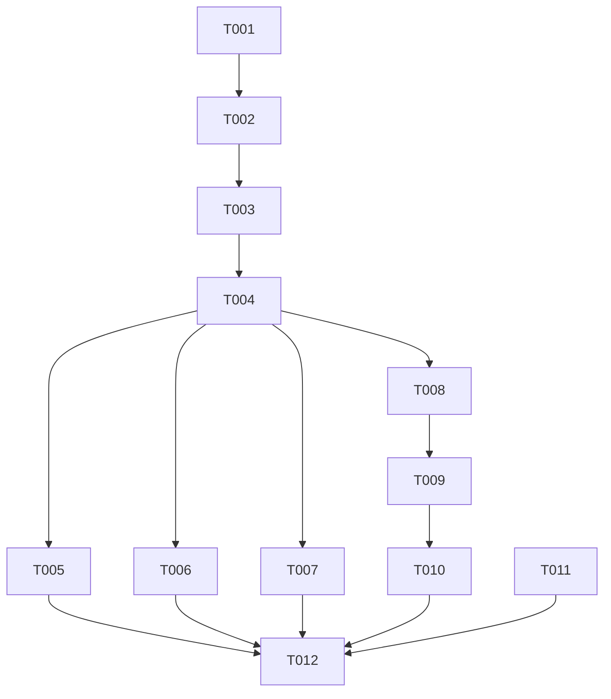

# Tasks: Dynamic Mediator Fee Safety Net

**Input**: Design documents from `/specs/008-mediator-fee-safety-net/`

**Prerequisites**: plan.md (required), spec.md (required for user stories)

---

## Phase 1: Setup (Shared Infrastructure)

**Purpose**: Task initialization and workspace alignment

- [ ] T001 Initialize git branch `008-mediator-fee-safety-net` and verify clean working tree

---

## Phase 2: Foundational (Blocking Prerequisites)

**Purpose**: Core smart contract modifications required before user stories can be tested

- [ ] T002 Update smart contract `escrow.py` to refactor `_send_fee_split` method to support conditional mediator fee redirection to the claimant
- [ ] T003 Update method call parameters to `_send_fee_split` in `escrow.py` across `approve_work`, `resolve_dispute`, and other payout flows
- [ ] T004 Compile modified `escrow.py` contract using project compilation script `compile_teal.py` and verify zero compiler errors

---

## Phase 3: User Story 1 — HITM Mode Payout (Priority: P1)

**Goal**: Verify mediator fee is redirected to worker on approval in HITM mode

- [ ] T005 Write unit tests in `tests/test_fee_safety_net.py` deploying contract in HITM mode and asserting claimant receives mediator fee on approval

---

## Phase 4: User Story 2 — Undisputed Auto Payout (Priority: P1)

**Goal**: Verify mediator fee is redirected to worker on standard Auto-mode approval

- [ ] T006 Add unit tests in `tests/test_fee_safety_net.py` asserting Auto-mode contract transfers mediator fee to claimant on standard approval

---

## Phase 5: User Story 3 — Disputed Auto Payout (Priority: P2)

**Goal**: Verify mediator fee is split among mediators during dispute resolutions

- [ ] T007 Add unit tests in `tests/test_fee_safety_net.py` asserting Auto-mode contract transfers mediator fee to mediator account on dispute resolution

---

## Phase 6: User Story 4 — Dynamic Frontend UI (Priority: P1)

**Goal**: Update dashboard display to show dynamic fee safety nets

- [ ] T008 Modify frontend hook `dashboard/src/hooks/useFeeBreakdown.ts` to compute mediator fee as `0` under HITM or undisputed states
- [ ] T009 Modify component `dashboard/src/components/ui/FeeBreakdownTable.tsx` to handle dynamic labels and helper tooltips
- [ ] T010 Run Playwright E2E test `dashboard/e2e/fee-safety-net.spec.ts` verifying visual correctness of the dynamic fee layout

---

## Phase 7: Polish & Cross-cutting Concerns

**Goal**: Ensure API routing matches calculations

- [ ] T011 Align backend routers in `gateway/routers/bounties.py` to estimate fees using the same safety net rules
- [ ] T012 Verify all unit, integration, and E2E tests pass cleanly before final PR commit

---

## Dependencies

