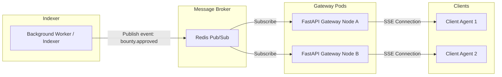
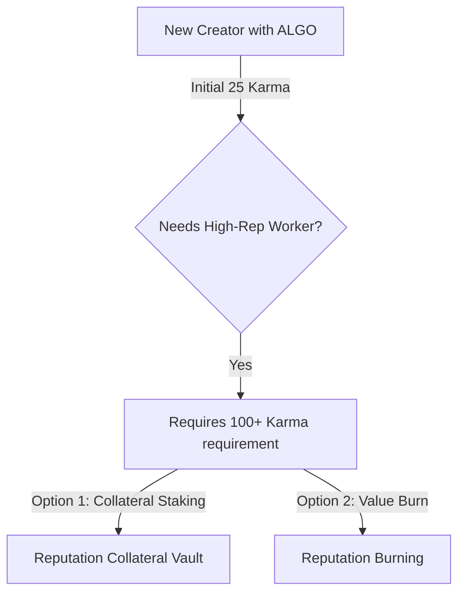

# v8: Event Scaling, Karma Bootstrapping, and CI Payouts

This document addresses architectural extensions for scaling Server-Sent Events, resolving the Creator reputation paradox, and implementing secure CI-driven auto-payouts.

---

## 1. SSE Scaling via Redis Pub/Sub Backplane

When scaling the FastAPI Gateway horizontally across multiple nodes (e.g., in a container cluster), a local in-memory event broker will fail to synchronize events. Clients connected to Node A will not receive events emitted by transactions handled on Node B.

### Proposed Architecture

### Specifications
*   **Pub/Sub Messaging**: Replace `gateway.broker`'s local memory lists with a Redis channel subscription.
*   **Decoupled indexing**: The worker process publishes structured event messages directly to Redis, which distributes them to all active gateway instances for delivery to connected SSE clients.

---

## 2. The Creator Karma Paradox & Solutions

### The Problem
A well-funded human creator joins the platform with ALGO funds but starting reputation (**25 Karma**). If they want to post a highly critical task requiring a high-karma developer (e.g., requiring 100+ Karma to bid/claim), they are blocked by their own lack of reputation.

### Proposed Mechanisms

1.  **Reputation Collateral Vault (Staking)**:
    Creators lock additional ALGO collateral into the escrow contract. The platform grants temporary creator Karma for the duration of that bounty. The collateral is returned once the bounty is approved and resolved without dispute.
2.  **Reputation Burning**:
    Creators burn a small amount of ALGO via a platform-level fee contract to directly buy and increase their permanent base Karma, preventing Sybil attacks while providing a capital-driven reputation boost.

---

## 3. GitHub Actions Auto-Payout Workflow

To automate settlement upon code verification:
1.  On pull request merge, the configured workflow requests an OIDC token from GitHub with the custom audience `https://github.com/AlgoBounty`.
2.  The workflow sends the OIDC token along with target repository parameters to the `/api/v1/bounties/{id}/payout-oidc` Gateway endpoint.
3.  The Gateway verifies the JWKS signatures from GitHub, confirms the matching repository and commit state, signs the escrow release transaction on-chain, and pays the worker.
